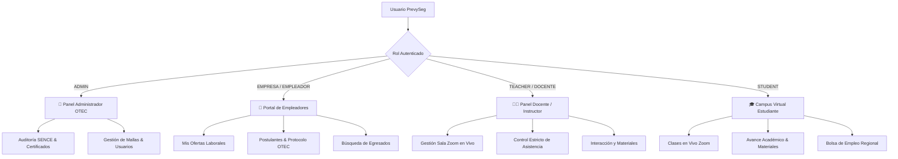
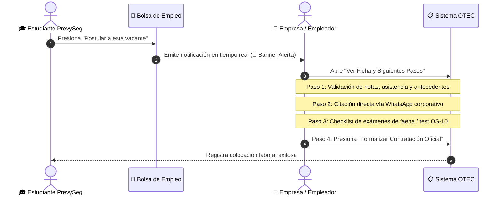

# Manual de Arquitectura, Código y Buenas Prácticas - PrevySeg 2026

> **OTEC PrevySeg Capacitaciones**
> *Plataforma Integral de Gestión Académica, Acreditación Normativa (SENCE & SPD) y Bolsa de Empleo Regional*
> **Versión:** 2.6.0 | **Año:** 2026 | **Propietario:** Sebastián Acuña

---

## 1. Visión General del Sistema

**PrevySeg 2026** es una plataforma web integral diseñada para la administración académica, operativa y laboral de un Organismo Técnico de Capacitación (OTEC) en la Macro Zona Norte de Chile (Arica, Iquique, Antofagasta y Calama).

La plataforma da soporte a dos áreas formativas estratégicas:

1. **Seguridad Privada:** Regulada por la Subsecretaría de Prevención del Delito (SPD), Carabineros de Chile (OS-10) y la Ley N° 21.659.
2. **Escuela de Oficios Industriales y Minería:** Regulada bajo la Norma Chilena de Calidad **NCh 2728** y franquicias **SENCE** (Operación de Grúa Horquilla Clase D, Soldadura 3G/4G, Electricidad Industrial y Energía Solar Fotovoltaica).

---

## 2. Ecosistema de Roles y Permisos

La plataforma cuenta con **4 roles estrictamente tipificados** y desacoplados:



### Detalle de Capacidades por Rol:

- **👑 Administrador OTEC (`ADMIN`):**
  - Auditoría y cumplimiento normativo SENCE / SPD.
  - Emisión y validación criptográfica de certificados oficiales con folio y hash.
  - Creación y administración de participantes con encriptación Bcrypt.
- **🏢 Empresa / Empleador (`EMPRESA`):**
  - Publicación y control de vacantes laborales para oficios y seguridad privada.
  - Notificaciones en tiempo real cuando un alumno postula desde la bolsa.
  - **Protocolo OTEC de 4 Pasos:** Validación curricular -> Citación WhatsApp -> Evaluación técnica de terreno -> Formalización de la contratación.
- **👨‍🏫 Profesor / Docente (`TEACHER` / `DOCENTE`):**
  - Control de sala de videoconferencias Zoom (enlace, ID, clave, switch de sesión activa).
  - Toma de asistencia sincrónica obligatoria.
  - Carga y repositorio de materiales didácticos, guías de estudio y presentaciones.
- **🎓 Estudiante (`STUDENT`):**
  - Acceso directo al aula virtual y clases Zoom sincrónicas programadas.
  - Descarga de guías y materiales del curso matriculado.
  - Consulta y postulación a ofertas en la Bolsa de Empleo Regional.

---

## 3. Arquitectura Tecnológica y Stack


| Capa                           | Tecnología                     | Justificación Técnica                                                                           |
| :------------------------------- | :-------------------------------- | :-------------------------------------------------------------------------------------------------- |
| **Framework Frontend**         | React 19 + Vite                 | Renderizado reactivo ultrarrápido, HMR instantáneo y empaquetado optimizado.                    |
| **Estilos & UI**               | Tailwind CSS v4                 | Diseño responsivo con arquitectura de tokens, paletas semánticas y cero CSS muerto.             |
| **Animaciones & Transiciones** | Framer Motion                   | Micro-animaciones fluidas para modales, banners y cambios de vista.                               |
| **Iconografía**               | Lucide React                    | Conjunto coherente, accesible y ligero de iconos vectoriales SVG.                                 |
| **Base de Datos & Auth**       | Supabase (PostgreSQL 15)        | Relacional con ACID, Row Level Security (RLS) y extensiones criptográficas`pgcrypto`.            |
| **Criptografía**              | Blowfish Bcrypt (256-bit)       | Cifrado unidireccional de contraseñas con factor de costo 10. Cero texto plano.                  |
| **Servidor Portable**          | Node.js HTTP (`serve_dist.cjs`) | Servidor autónomo sin dependencias para distribución local instantánea (`ABRIR_PREVYSEG.bat`). |

---

## 4. Estructura de Directorios del Código

```text
prevyseg/
├── .docs/                               # Documentación técnica, diagramas y SRS
│   ├── MANUAL_DE_ARQUITECTURA_Y_BUENAS_PRACTICAS.md
│   ├── SRS_Especificacion_Requerimientos_Software_PrevySeg.md
│   └── diagrams/                        # Diagramas SVG y visor interactivo HTML
├── public/                              # Activos estáticos, favicon y documentos
├── scripts/                             # Utilidades de desarrollo y despliegue
│   ├── deploy_security_and_validations.mjs  # Procedimientos almacenados y pgcrypto
│   ├── update_employer_role_to_empresa.mjs  # Migración de constraints PostgreSQL
│   └── serve_dist.cjs                   # Servidor HTTP local zero-config
├── src/
│   ├── components/                      # Componentes del portal público
│   │   ├── Navbar.jsx                   # Navegación principal y acceso a LMS
│   │   ├── HeroSection.jsx              # Banner de bienvenida y llamados a la acción
│   │   ├── ProgramsSection.jsx          # Catálogo de cursos con filtros de escuela
│   │   ├── AdmissionSection.jsx         # Formulario de postulación con cálculo de cuotas
│   │   └── Modals.jsx                   # Modal de inicio de sesión con 1-Click Login
│   ├── config/
│   │   └── supabase.js                  # Cliente Supabase, login con RUT y llamadas RPC
│   ├── lms/                             # Campus Virtual / Learning Management System
│   │   ├── LMSLayout.jsx                # Layout principal, menú lateral dinámico por rol
│   │   └── views/                       # Vistas especializadas por rol
│   │       ├── PersonalAreaView.jsx     # Campus del alumno, progreso y asignaturas
│   │       ├── StudentLiveClassesView.jsx # Clases en vivo Zoom para estudiantes
│   │       ├── TeacherPortalView.jsx    # Panel docente integrado (Zoom, asistencia, guías)
│   │       ├── EmployerPortalView.jsx   # Portal de empresas, ofertas, candidatos y protocolo
│   │       ├── JobBoardView.jsx         # Bolsa de empleo regional para alumnos
│   │       ├── ParticipantsView.jsx     # Directorio de usuarios y matriculados (4 roles)
│   │       ├── CertificateApprovalView.jsx # Aprobación de certificados con hash/folio
│   │       ├── CoursesView.jsx          # Gestión de cursos y programas SENCE
│   │       └── AdminGeneralView.jsx     # Panel de auditoría y métricas de plataforma
│   ├── utils/
│   │   └── validation.js                # Validación de RUT chileno (Módulo 11), email y teléfono
│   ├── App.jsx                          # Router principal, estado de sesión global y modales
│   ├── main.jsx                         # Punto de entrada de la aplicación React
│   └── index.css                        # Importaciones de Tailwind CSS v4 y tema base
├── ABRIR_PREVYSEG.bat                   # Lanzador Windows de 1-Clic para evaluación rápida
├── README_INSTRUCCIONES.txt             # Guía paso a paso para usuarios finales
├── README.md                            # Ficha técnica principal del repositorio
└── vite.config.js                       # Configuración de Vite con rutas relativas (base: './')
```

---

## 5. Diseño de Base de Datos y Políticas de Seguridad

### 5.1 Restricción de Roles en `public.users`

La columna `rol` en PostgreSQL cuenta con una restricción estricta (`CHECK constraint`):

```sql
ALTER TABLE public.users ADD CONSTRAINT users_rol_check 
CHECK (rol IN ('ADMIN', 'TEACHER', 'DOCENTE', 'STUDENT', 'EMPRESA', 'EMPLEADOR', 'EMPLOYER'));
```

### 5.2 Criptografía de Contraseñas (Bcrypt)

Las contraseñas **nunca se almacenan en texto plano**. Se procesan a través de la función `admin_create_user` y `register_new_student` utilizando la extensión `pgcrypto`:

```sql
v_encrypted_pw := extensions.crypt(p_password, extensions.gen_salt('bf', 10));
```

Al autenticar, el procedimiento compara de forma segura:

```sql
IF user_record.encrypted_password = extensions.crypt(p_password, user_record.encrypted_password) THEN
    -- Contraseña válida
END IF;
```

### 5.3 Tabla `public.jobs` (Bolsa de Empleo)

Estructura de convocatorias laborales vinculada a empleadores:

- `id` (UUID, Primary Key)
- `cargo` (VARCHAR)
- `empresa` (VARCHAR)
- `renta` (NUMERIC)
- `jornada` (VARCHAR: ej. "Turno 7x7 Rotativo")
- `requiere_os10` (BOOLEAN: discrimina entre Escuela de Oficios y Seguridad SPD)
- `descripcion` (TEXT)
- `activo` (BOOLEAN)
- `created_at` (TIMESTAMPTZ)

---

## 6. Sistema de Comunicación y Sincronización en Tiempo Real

Para mantener un desacoplamiento limpio entre vistas sin incurrir en dependencias circulares complejas, se implementó una arquitectura de **Eventos de Ventana Personalizados (Custom Events)** combinados con persistencia local:


| Evento                          | Origen                   | Destino                  | Propósito                                                                     |
| :-------------------------------- | :------------------------- | :------------------------- | :------------------------------------------------------------------------------- |
| `prevyseg_new_notification`     | `JobBoardView.jsx`       | `EmployerPortalView.jsx` | Alerta inmediata al empleador cuando un estudiante postula a su vacante.       |
| `prevyseg_applications_updated` | `JobBoardView.jsx`       | `EmployerPortalView.jsx` | Actualiza la lista de postulantes y expedientes en el portal de la empresa.    |
| `prevyseg_jobs_updated`         | `EmployerPortalView.jsx` | `JobBoardView.jsx`       | Refresca las ofertas en la bolsa del estudiante al publicar o pausar vacantes. |

---

## 7. Protocolo OTEC: Siguientes Pasos con el Estudiante Inscrito

Cuando un empleador recibe una postulación, el sistema despliega el **Protocolo OTEC de Selección y Empleabilidad**:



---

## 8. Guía de Buenas Prácticas para Desarrolladores

Al modificar o ampliar esta base de código, es obligatorio cumplir con los siguientes estándares:

### 8.1 Mantener Rutas Relativas para Portabilidad

En [`vite.config.js`](file:///c:/Users/ashle/OneDrive/Escritorio/prevyseg/vite.config.js), la propiedad `base: './'` debe permanecer activa. Esto garantiza que el empaquetado de producción (`dist/`) funcione tanto en la raíz de un dominio como en subdirectorios o en el servidor de pruebas local sin requerir reconfiguración de DNS.

### 8.2 Separación Estricta de Vistas por Rol

- **No introducir componentes de un rol dentro de otro.** El menú lateral de [`LMSLayout.jsx`](file:///c:/Users/ashle/OneDrive/Escritorio/prevyseg/src/lms/LMSLayout.jsx) gobierna la visualización según `currentUser.rol`.
- Si se crea un nuevo apartado para docentes, agregarlo a `TeacherPortalView.jsx`.
- Si se crea una herramienta para reclutamiento, integrarla en `EmployerPortalView.jsx`.

### 8.3 Validación de Datos del Lado del Cliente y Servidor

- Todo RUT ingresado debe procesarse con las funciones `cleanRut`, `formatRut` y validarse con el algoritmo oficial de Módulo 11 en [`src/utils/validation.js`](file:///c:/Users/ashle/OneDrive/Escritorio/prevyseg/src/utils/validation.js).
- Las contraseñas deben cumplir con la longitud mínima de 6 caracteres antes de enviarse al procedimiento criptográfico.

### 8.4 Paletas Semánticas por Rol

Para mantener la coherencia visual institucional, utilizar las siguientes identidades cromáticas:

- **Administrador:** Púrpura / Índigo (`from-purple-900 to-indigo-950`, acentos `purple-500`).
- **Empresa / Empleador:** Ámbar / Oro Industrial (`from-amber-500 to-[#d97706]`, acentos `amber-400`).
- **Profesor / Docente:** Azul Marino / Pizarra (`from-[#072B4F] to-slate-900`, acentos `sky-500`).
- **Estudiante:** Verde Azulado / Turquesa (`#00c2b2`, acentos `teal-600`).

---

## 9. Comandos de Operación

```bash
# Iniciar entorno de desarrollo local con Vite
npm run dev

# Compilar paquete de producción verificado
npm run build

# Ejecutar servidor de prueba de producción local
node scripts/serve_dist.cjs

# Ejecutar migración de roles en PostgreSQL (en caso de actualización de esquema)
node scripts/update_employer_role_to_empresa.mjs
```

---

*Manual mantenido y actualizado conforme a las auditorías técnicas del sistema PrevySeg 2026.*
