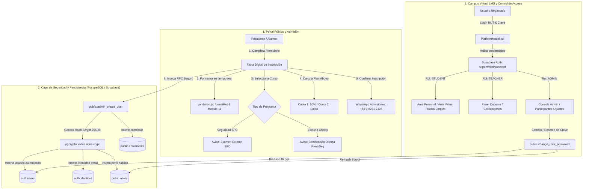
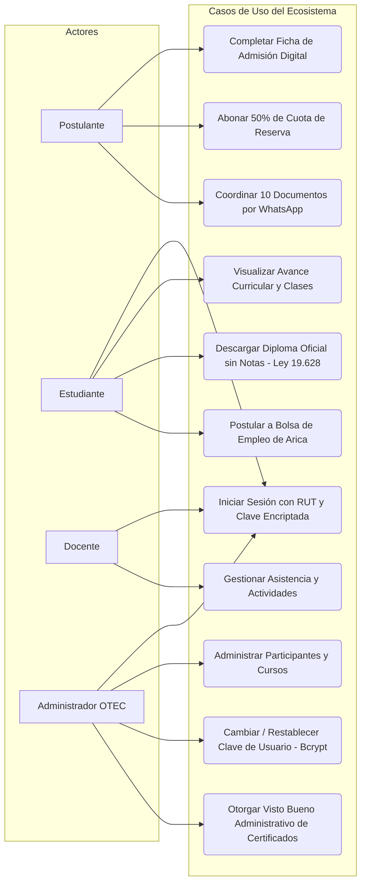
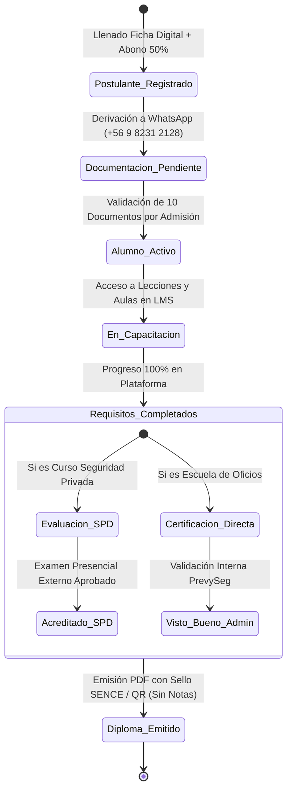

# 📘 Especificación de Requerimientos de Software (SRS / ERS)

## Ecosistema Digital PrevySeg 2026

**Código Documental:** `ERS-PREVYSEG-2026-V3.0`  
**Organización:** PrevySeg Capacitaciones Ltda. (OTEC Registro SENCE N° 1238088725 • Norma Chilena NCh 2728:2015)  
**Estándar de Ingeniería:** ISO/IEC/IEEE 29148:2018 / IEEE Std 830-1998 / ISO/IEC 25010  
**Fecha de Emisión:** Septiembre 2026  
**Último Commit en Repositorio:** `57f7822` (Rama `main` • GitHub: `Sebastianaso/PrevySeg2026`)  
**Estado:** Aprobado para Producción y Certificación de Calidad  

---

## 🗂️ 1. Control de Versiones del Documento

| Versión | Fecha | Autor / Rol | Descripción del Cambio | Aprobador |
| :---: | :---: | :--- | :--- | :---: |
| **v1.0.0** | 01/09/2026 | Equipo Frontend | Levantamiento inicial de requerimientos para portal web y vitrina de cursos. | PM / OTEC |
| **v1.5.0** | 08/09/2026 | Equipo Fullstack | Especificación funcional del Campus Virtual LMS, autenticación con RUT y roles RBAC. | Dir. Académica |
| **v2.0.0** | 22/09/2026 | Ingeniería de Software | Depuración a 6 cursos SENCE, despacho de diplomas por correo y confidencialidad Ley 19.628. | Dirección OTEC |
| **v3.0.0** | 04/09/2026 | Arquitecto TI & Seguridad | **Actualización Integral Post-Push (`35c4d31` / `57f7822`):** • Criptografía de contraseñas con Blowfish Bcrypt 256-bit (`pgcrypto`) en PostgreSQL y Supabase Auth. • Módulo centralizado de validaciones (RUT Módulo 11, formato dinámico en vivo, email RFC 5322, medidor de fuerza de clave). • Ficha Digital Oficial de Admisión con cálculo de abono 50% (Cuota 1 y Cuota 2) y distinción SPD vs Oficios. • Flujo de validación documental vía WhatsApp Business (+56 9 8231 2128) y Buzón de Consultas. • Panel administrativo con gestión de participantes y reseteo de claves encriptadas. • Incorporación de diagramas de arquitectura, casos de uso y ciclo de vida de datos. | Dirección General PrevySeg |

---

## 🎯 2. Introducción y Fundamentos de Ingeniería

### 2.1 Propósito del Sistema
Formalizar, delimitar y especificar exhaustivamente los requerimientos funcionales (RF), requerimientos no funcionales (RNF), restricciones de seguridad criptográfica y reglas de negocio del ecosistema digital de **PrevySeg Capacitaciones Ltda.**, comprendiendo tanto el Portal Web Corporativo y de Admisión como el Campus Virtual LMS.

### 2.2 Alcance del Sistema (System Scope)
1. **Portal Web Corporativo y Admisión Online:**
   - Vitrina oficial de programas de capacitación (Seguridad Privada SPD y Escuela de Oficios Industriales).
   - Ficha Digital de Admisión con cálculo automático del abono del 50% (Cuota N°1 de reserva y Cuota N°2 al inicio).
   - Módulo explicativo normativo con diferenciación entre cursos con examen ante la Subsecretaría de Prevención del Delito (SPD) y cursos con certificación directa PrevySeg OTEC.
   - Buzón de preguntas y dudas con derivación y coordinación documental vía WhatsApp (+56 9 8231 2128).
2. **Criptografía, Seguridad y Control de Acceso (RBAC):**
   - Encriptación Blowfish Bcrypt (256-bit) para todas las contraseñas en PostgreSQL y Supabase Auth mediante procedimientos almacenados definidos con `SECURITY DEFINER`.
   - Control de acceso basado en roles (`ADMIN`, `TEACHER`, `STUDENT`) con guardas de navegación.
   - Acceso demo 1-Click con credenciales seguras para evaluación de los 3 perfiles.
3. **Módulo de Validaciones Centralizadas:**
   - Algoritmo matemático Módulo 11 para Cédula de Identidad / RUT chileno con formateo dinámico (`XX.XXX.XXX-X`).
   - Validación de emails RFC 5322, teléfonos y medidor de complejidad de contraseñas en 5 niveles.
4. **Campus Virtual LMS:**
   - Área Personal del Alumno con avance porcentual, estado de matrícula SENCE y descarga de diplomas.
   - Aula Virtual con visualización de unidades didácticas, lecciones y evaluaciones.
   - Panel de Visto Bueno Administrativo y emisión de Diplomas Oficiales sin notas numéricas (Ley N° 19.628).
   - Gestión de Participantes con creación de usuarios encriptados y modal para cambio/reseteo de contraseñas.
   - Bolsa de Empleo Regional de Arica con postulación curricular directa.

### 2.3 Marco Normativo y Regulatorio
- **Norma Chilena NCh 2728:2015:** Sistema de Gestión de la Calidad para Organismos Técnicos de Capacitación (OTEC).
- **Ley N° 19.518:** Estatuto de Capacitación y Empleo (Franquicia Tributaria SENCE).
- **Decreto Ley N° 3.607 y Ley N° 21.659:** Marco regulatorio de Seguridad Privada y acreditaciones fiscalizadas por la SPD y Carabineros OS-10.
- **Ley N° 19.628:** Protección de la Vida Privada (Confidencialidad absoluta de calificaciones numéricas en diplomas públicos).

---

## 👥 3. Matriz de Actores y Perfiles del Sistema

| Actor / Rol | Descripción y Competencias | Responsabilidades Principales |
| :--- | :--- | :--- |
| **Administrador OTEC (`ADMIN`)** | Directorio y personal administrativo de PrevySeg. | Gestión integral del LMS, administración de participantes, reseteo de claves, visto bueno de diplomas y ajustes del sitio. |
| **Docente / Instructor (`TEACHER`)** | Profesores e instructores acreditados ante la SPD. | Impartición de clases, revisión de actividades, control de asistencia pedagógica y acompañamiento del alumno. |
| **Estudiante / Alumno (`STUDENT`)** | Postulantes matriculados en programas de seguridad u oficios. | Acceso al aula virtual, lecciones, descarga de material didáctico, postulación a la bolsa de empleo y descarga de diplomas. |
| **Postulante / Público General** | Personas naturales interesadas en capacitarse. | Llenado de Ficha de Inscripción, abono del 50%, consulta de requisitos documentales y contacto por WhatsApp. |
| **Empresa Patrocinante / RRHH** | Encargados de capacitación y prevención corporativos. | Consulta de tramos de franquicia SENCE, cotización corporativa y postulación masiva de trabajadores. |

---

## 📐 4. Diagramas de Arquitectura y Procesos

### 4.1 Diagrama de Arquitectura y Flujo de Admisión con Criptografía Bcrypt

---

### 4.2 Diagrama de Casos de Uso por Roles (RBAC)

---

### 4.3 Diagrama de Estados del Alumno y Matrícula

---

## ⚙️ 5. Matriz Detallada de Requerimientos Funcionales (RF)

| Código | Módulo | Requerimiento Funcional | Descripción Técnica y Criterio de Aceptación | Prioridad | Actor |
| :---: | :--- | :--- | :--- | :---: | :--- |
| **RF-01** | Admisión | **Ficha de Inscripción Digital Oficial** | Captura datos personales del alumno dependiente (Nombre completo, RUT, Fecha de Nacimiento, País, Teléfono, Domicilio, Correo, Condición Laboral y Empresa). | **Must Have** | Postulante |
| **RF-02** | Admisión | **Cálculo Dinámico del Abono del 50%** | Desglose automático de Cuota N°1 (50% de reserva al inscribirse) y Cuota N°2 (saldo restante al inicio de clases) según arancel oficial del curso. | **Must Have** | Postulante |
| **RF-03** | Normativo | **Diferenciación Explicativa SPD vs Oficios** | Despliegue de aviso normativo claro: Cursos de Guardia requieren examen presencial externo ante la SPD; Cursos de Oficios otorgan certificación directa OTEC PrevySeg. | **Must Have** | Postulante |
| **RF-04** | Admisión | **Coordinación Documental por WhatsApp** | Generación de mensaje codificado URI hacia WhatsApp Oficial (+56 9 8231 2128) con código de solicitud y detalle de los 10 documentos oficiales requeridos. | **Must Have** | Postulante |
| **RF-05** | Admisión | **Buzón de Preguntas o Dudas** | Formulario interactivo con aviso explícito de que el equipo se comunicará para orientar y solicitar documentos complementarios si fuese necesario. | **Should Have** | Postulante |
| **RF-06** | Seguridad | **Encriptación de Contraseñas (Bcrypt)** | Almacenamiento seguro de todas las contraseñas mediante hash Blowfish Bcrypt (256-bit, costo 10) usando `pgcrypto` en PostgreSQL y Supabase Auth. Prohibido texto plano. | **Must Have** | Sistema / BD |
| **RF-07** | Seguridad | **Procedimiento `register_new_student`** | Función PL/pgSQL atómica para registrar al estudiante con clave encriptada, crear usuario en `auth.users`, `auth.identities`, `public.users` y matrícula inicial. | **Must Have** | Postulante |
| **RF-08** | Seguridad | **Procedimiento `admin_create_user`** | Función PL/pgSQL para creación de usuarios desde consola administrativa con rol asignable (`ADMIN`, `TEACHER`, `STUDENT`) y contraseña encriptada. | **Must Have** | Administrador |
| **RF-09** | Seguridad | **Procedimiento `change_user_password`** | Función PL/pgSQL para actualización segura y re-hasheo de contraseñas de usuarios en ambas tablas (`auth.users` y `public.users`). | **Must Have** | Administrador |
| **RF-10** | Validación | **Algoritmo Módulo 11 para RUT** | Validación estricta y matemática del dígito verificador del RUT chileno (`calculateRutDv` y `validateRut`). | **Must Have** | Todos |
| **RF-11** | Validación | **Formateador Dinámico de RUT** | Formateo automático de inputs en vivo a estructura `XX.XXX.XXX-X` mientras el usuario escribe (`formatRut`). | **Must Have** | Todos |
| **RF-12** | Validación | **Medidor de Fuerza de Clave** | Evaluación en tiempo real de la robustez de contraseñas con barra de progreso y 5 niveles visuales (Muy Débil a Muy Segura). | **Should Have** | Postulante |
| **RF-13** | Seguridad | **Modal de Acceso 1-Click Demo** | Plataforma modal con alternancia de visibilidad de clave (ojo/candado) y accesos rápidos pre-cargados para los 3 roles del sistema. | **Must Have** | Todos |
| **RF-14** | LMS Admin | **Gestión de Participantes y Claves** | Tabla interactiva de alumnos con filtros por rol, curso, búsqueda por RUT, exportación y nuevo modal para **Cambiar / Restablecer Contraseña (🔑)**. | **Must Have** | Administrador |
| **RF-15** | LMS Alumno | **Área Personal y Mis Cursos** | Panel de control del estudiante con avance curricular porcentual, estado SENCE y banner de certificados oficiales emitidos. | **Must Have** | Estudiante |
| **RF-16** | LMS Alumno | **Aula Virtual y Lecciones** | Vista estructurada de módulos formativos, contenido pedagógico y cuestionarios interactivos. | **Must Have** | Estudiante |
| **RF-17** | Certificación | **Visto Bueno Administrativo** | Panel de validación de requisitos legales para autorizar y emitir diplomas oficiales en PDF con sello SENCE y QR. | **Must Have** | Administrador |
| **RF-18** | Certificación | **Confidencialidad Ley N° 19.628** | Cero exposición de notas numéricas en los certificados y diplomas emitidos para salvaguardar la privacidad del estudiante. | **Must Have** | Sistema / OTEC |
| **RF-19** | Servicios | **Bolsa de Empleo Regional Arica** | Catálogo de vacantes laborales en seguridad para la región de Arica y Parinacota con postulación curricular directa con RUT. | **Should Have** | Estudiante |
| **RF-20** | Comercial | **Matriz de Tramos SENCE** | Exposición de tramos de franquicia tributaria (100% hasta 25 UTM, 50%, 15% y Pago Particular) para empresas y RRHH. | **Must Have** | Empresas |

---

## 🛡️ 6. Matriz de Requerimientos No Funcionales (RNF - ISO/IEC 25010)

| Código | Dimensión ISO 25010 | Requisito y Criterio de Calidad | Métrica Objetivo |
| :---: | :--- | :--- | :--- |
| **RNF-01** | **Seguridad Criptográfica** | Todas las contraseñas deben estar hasheadas con Blowfish Bcrypt ($2a$10$). Prohibido almacenar texto plano bajo cualquier condición. | 100% claves con hash Bcrypt |
| **RNF-02** | **Integridad de Datos** | Sincronización atómica e idempotente (`ON CONFLICT`) entre `auth.users`, `auth.identities` y `public.users`. | 0 fallos de clave foránea |
| **RNF-03** | **Seguridad (RBAC)** | Aislamiento estricto de vistas y acciones administrativas según el rol del usuario autenticado (`ADMIN`, `TEACHER`, `STUDENT`). | 100% rutas protegidas |
| **RNF-04** | **Eficiencia de Rendimiento** | Tiempo de renderizado inicial (FCP) inferior a 1.2 segundos y compilación limpia con Vite. | FCP ≤ 1.2s • 0 errores de build |
| **RNF-05** | **Disponibilidad Operacional** | Disponibilidad del servicio 24/7/365 con un Acuerdo de Nivel de Servicio (SLA) del 99.8% mensual. | Uptime ≥ 99.8% |
| **RNF-06** | **Usabilidad y Accesibilidad** | Interfaz clara con contraste WCAG 2.1 Nivel AA (`bg-slate-50`, `bg-white`, `text-slate-900`), tipografía legible y respuesta en vivo. | Ratio de contraste ≥ 4.5:1 |
| **RNF-07** | **Compatibilidad Cross-Browser** | Funcionamiento garantizado en Chrome, Edge, Firefox, Safari y navegadores móviles Android/iOS. | 100% navegadores estándar |
| **RNF-08** | **Mantenibilidad del Código** | Arquitectura modular desacoplada en React con librerías dedicadas (`src/config/supabase.js`, `src/utils/validation.js`). | Código modular sin deuda técnica |
| **RNF-09** | **Cumplimiento Normativo SENCE** | Trazabilidad y auditoría de participantes bajo la Norma Chilena NCh 2728:2015. | Auditoría SENCE 100% conforme |
| **RNF-10** | **Privacidad Legal (Ley 19.628)** | Certificados emitidos con acreditación cualitativa ("APROBADO") sin notas numéricas. | 0% notas en certificados |
| **RNF-11** | **Tolerancia a Fallos** | Captura de excepciones en tiempo de ejecución con React Error Boundaries y mensajes amigables al usuario. | 0 pantallas blancas |
| **RNF-12** | **Trazabilidad en Control de Versiones** | Registro histórico en Git con commits semánticos y descriptivos en español sincronizados en GitHub. | Trazabilidad 100% en rama `main` |

---

## 🔗 7. Matriz de Trazabilidad de Requerimientos (RTM)

| Requerimientos | Módulo / Funcionalidad | Archivos / Componentes en Repositorio | Método de Verificación |
| :--- | :--- | :--- | :--- |
| **RF-01, RF-02, RF-03** | Ficha de Admisión y Abono 50% | [`src/components/EnrollmentForm.jsx`](file:///c:/Users/ashle/OneDrive/Escritorio/prevyseg/src/components/EnrollmentForm.jsx) | Prueba de cálculo de cuotas y postulación |
| **RF-04, RF-05** | WhatsApp y Buzón de Consultas | [`src/components/EnrollmentForm.jsx`](file:///c:/Users/ashle/OneDrive/Escritorio/prevyseg/src/components/EnrollmentForm.jsx), [`src/components/Modals.jsx`](file:///c:/Users/ashle/OneDrive/Escritorio/prevyseg/src/components/Modals.jsx) | Verificación de URI codificada y recepción |
| **RF-06, RF-07, RF-08, RF-09** | Criptografía Bcrypt & Procedimientos | [`src/config/supabase.js`](file:///c:/Users/ashle/OneDrive/Escritorio/prevyseg/src/config/supabase.js), [`scripts/deploy_security_and_validations.mjs`](file:///c:/Users/ashle/OneDrive/Escritorio/prevyseg/scripts/deploy_security_and_validations.mjs) | Prueba de RPCs y verificación de hashes en BD |
| **RF-10, RF-11, RF-12** | Validaciones & RUT Módulo 11 | [`src/utils/validation.js`](file:///c:/Users/ashle/OneDrive/Escritorio/prevyseg/src/utils/validation.js) | Suite de pruebas unitarias y E2E |
| **RF-13** | Modal de Acceso y Demo 1-Click | [`src/components/Modals.jsx`](file:///c:/Users/ashle/OneDrive/Escritorio/prevyseg/src/components/Modals.jsx) | Prueba de inicio de sesión con los 3 roles |
| **RF-14** | Gestión de Usuarios y Cambio de Clave | [`src/lms/views/ParticipantsView.jsx`](file:///c:/Users/ashle/OneDrive/Escritorio/prevyseg/src/lms/views/ParticipantsView.jsx) | Prueba de creación y reseteo de contraseñas |
| **RF-15, RF-16** | Campus LMS Alumno | [`src/lms/views/PersonalAreaView.jsx`](file:///c:/Users/ashle/OneDrive/Escritorio/prevyseg/src/lms/views/PersonalAreaView.jsx), [`src/lms/views/CourseClassroomView.jsx`](file:///c:/Users/ashle/OneDrive/Escritorio/prevyseg/src/lms/views/CourseClassroomView.jsx) | Inspección de avance y aula interactiva |
| **RF-17, RF-18** | Certificación y Confidencialidad | [`src/lms/views/CertificateApprovalView.jsx`](file:///c:/Users/ashle/OneDrive/Escritorio/prevyseg/src/lms/views/CertificateApprovalView.jsx) | Auditoría de certificados sin notas (Ley 19.628) |
| **RF-19** | Bolsa de Empleo Regional | [`src/lms/views/JobBoardView.jsx`](file:///c:/Users/ashle/OneDrive/Escritorio/prevyseg/src/lms/views/JobBoardView.jsx) | Prueba de postulación con perfil de alumno |
| **RF-20** | Franquicia Tributaria SENCE | [`src/components/SenceTramosSection.jsx`](file:///c:/Users/ashle/OneDrive/Escritorio/prevyseg/src/components/SenceTramosSection.jsx) | Verificación de los 4 tramos normativos |

---

## ✍️ 8. Aprobación y Validación Formal de Ingeniería

| Rol / Responsabilidad | Nombre y Especialidad | Estado y Fecha |
| :--- | :--- | :---: |
| **Ingeniero Líder de Software / TI** | **Sebastián Araya** — Ingeniería Informática | ✅ **APROBADO TÉCNICAMENTE** (Septiembre 2026) |
| **Director Académico OTEC** | **Ashley Adaros** — Dirección PrevySeg Ltda. | ✅ **APROBADO INSTITUCIONAL** (Septiembre 2026) |
| **Aseguramiento de Calidad NCh 2728 / SENCE** | **Comité de Calidad y Auditoría OTEC** | ✅ **CONFORME A NORMATIVA** (Septiembre 2026) |
