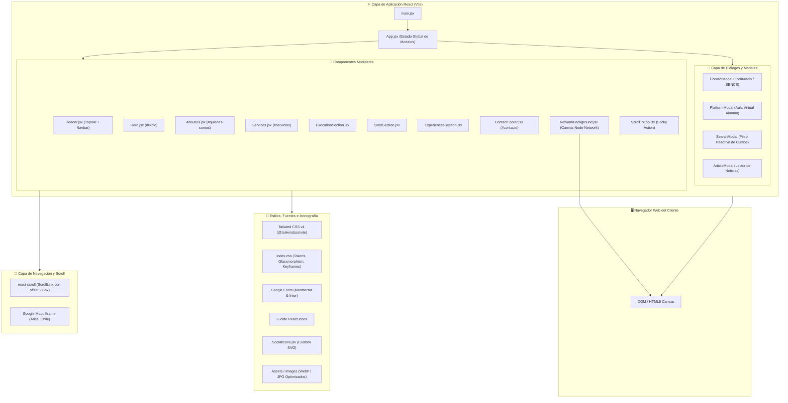

# 🏛️ Diagrama de Arquitectura de Software

Este diagrama detalla la arquitectura del sistema frontend de **PrevySeg**, ilustrando la interacción entre la capa de presentación en React, la biblioteca de estilos Tailwind CSS, los motores de navegación, la lógica de modales y los recursos estáticos.

