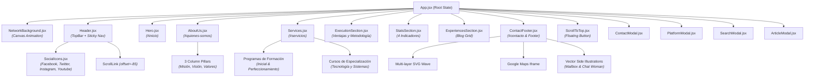

# 🌳 Diagrama de Jerarquía de Componentes

Este diagrama representa el árbol jerárquico de componentes de React, mostrando la distribución de props, callbacks y elementos anidados.

```mermaid
graph TD
    App["App.jsx (Root State)"]

    %% Direct Children
    App --> NetBg["NetworkBackground.jsx<br/><i>(Canvas Animation)</i>"]
    App --> Header["Header.jsx<br/><i>(TopBar + Sticky Nav)</i>"]
    App --> Hero["Hero.jsx<br/><i>(#inicio)</i>"]
    App --> AboutUs["AboutUs.jsx<br/><i>(#quienes-somos)</i>"]
    App --> Services["Services.jsx<br/><i>(#servicios)</i>"]
    App --> Execution["ExecutionSection.jsx<br/><i>(Ventajas y Metodología)</i>"]
    App --> Stats["StatsSection.jsx<br/><i>(4 Indicadores)</i>"]
    App --> Experiences["ExperiencesSection.jsx<br/><i>(Blog Grid)</i>"]
    App --> ContactFooter["ContactFooter.jsx<br/><i>(#contacto & Footer)</i>"]
    App --> ScrollToTop["ScrollToTop.jsx<br/><i>(Floating Button)</i>"]

    %% Modals
    App --> ContactModal["ContactModal.jsx"]
    App --> PlatformModal["PlatformModal.jsx"]
    App --> SearchModal["SearchModal.jsx"]
    App --> ArticleModal["ArticleModal.jsx"]

    %% Sub-components & elements
    Header --> SocialIcons["SocialIcons.jsx<br/><i>(Facebook, Twitter, Instagram, Youtube)</i>"]
    Header --> NavScrollLinks["ScrollLink <i>(offset=-85)</i>"]
    
    AboutUs --> StarPillars["3 Column Pillars<br/><i>(Misión, Visión, Valores)</i>"]
    
    Services --> FormationBlock["Programas de Formación<br/><i>(Inicial & Perfeccionamiento)</i>"]
    Services --> SpecBlock["Cursos de Especialización<br/><i>(Tecnología y Sistemas)</i>"]
    
    ContactFooter --> WavesSVG["Multi-layer SVG Wave"]
    ContactFooter --> GMap["Google Maps Iframe"]
    ContactFooter --> VectorArt["Vector Side Illustrations<br/><i>(Mailbox & Chat Woman)</i>"]
```
