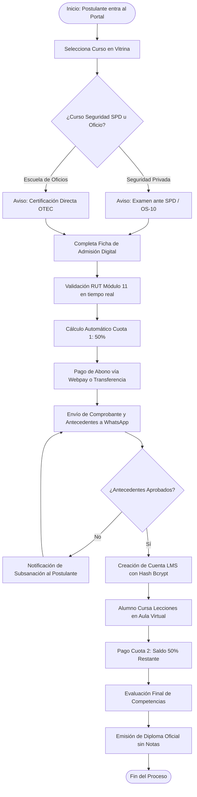
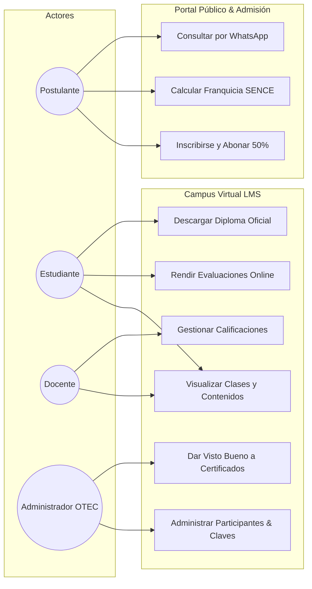
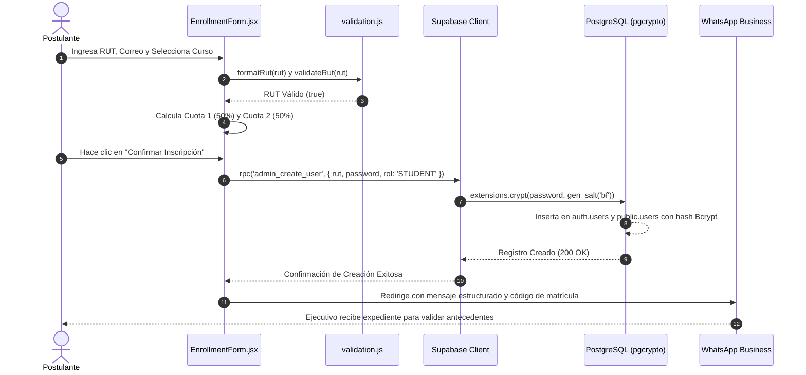
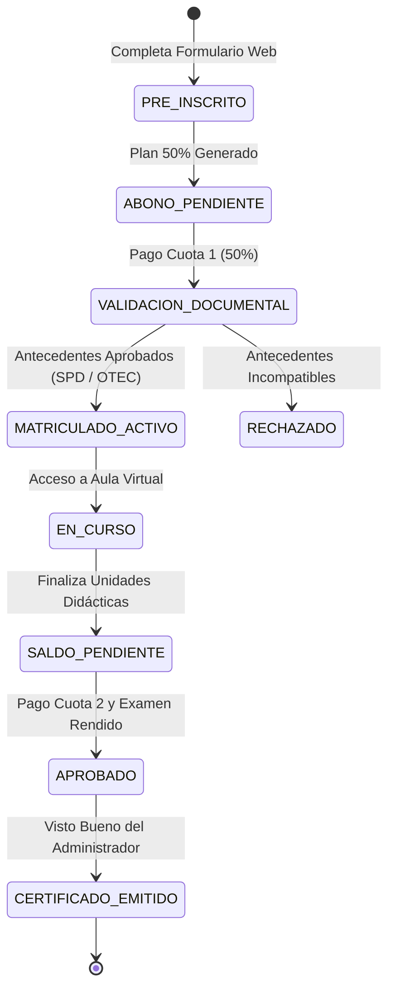
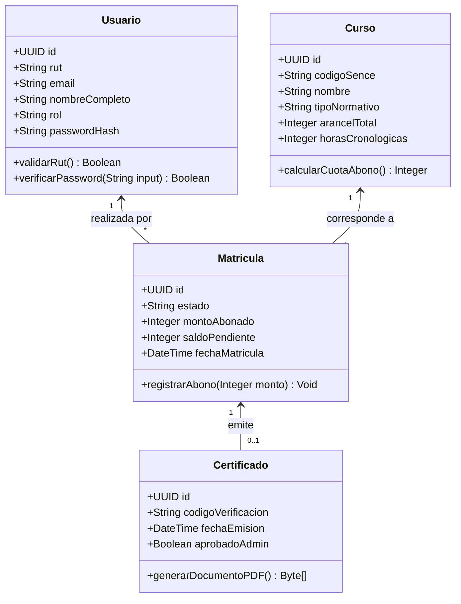
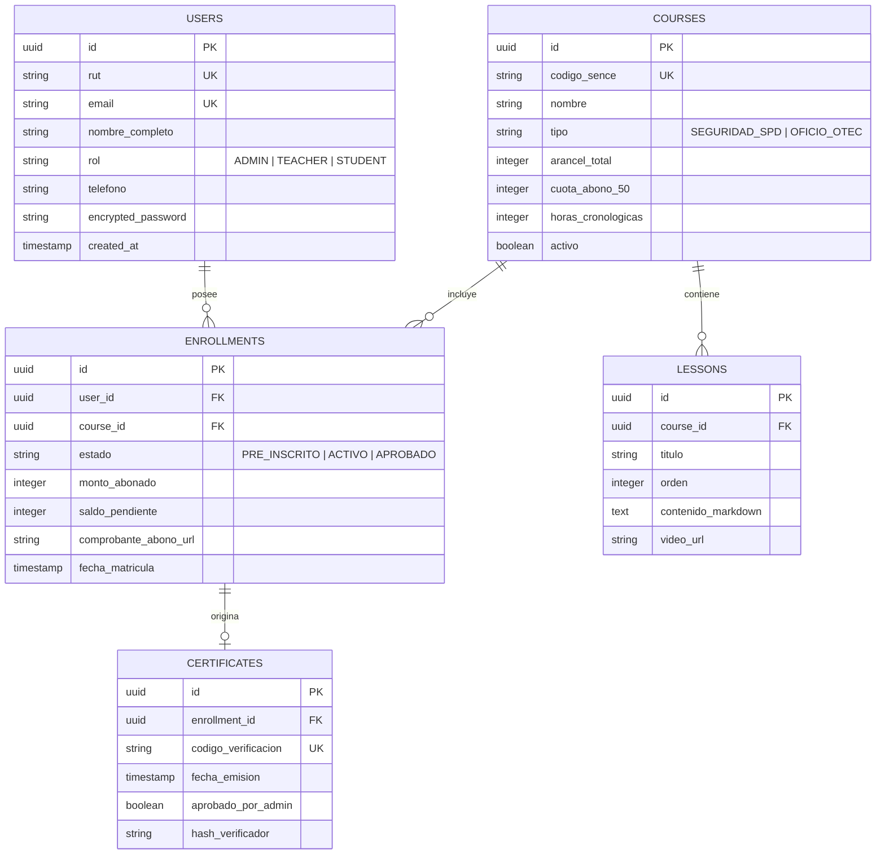
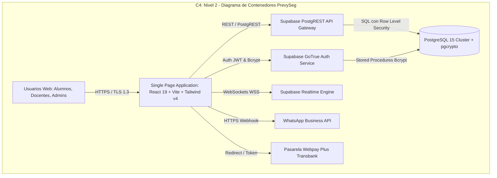
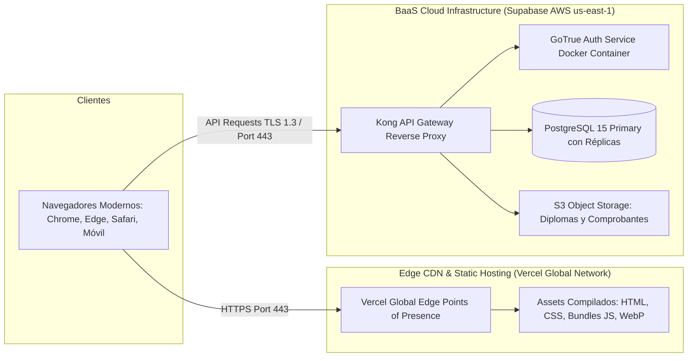

# 📊 Diagramas Oficiales de Arquitectura y Procesos - PrevySeg 2026

**Proyecto:** Ecosistema Digital, Portal de Admisión Digital & Campus Virtual LMS PrevySeg  
**Formato:** Mermaid.js editable  
**Archivos individuales `.mmd`:** Ubicados en `/.docs/diagrams/mmd/`  
**Visor Web Interactivo:** Abrir con doble clic en `/.docs/diagrams/visor_diagramas.html`

---

## 1. Flujo de Procesos To-Be (BPMN 2.0)
*Archivo:* [01_flujo_procesos_bpmn.mmd](./mmd/01_flujo_procesos_bpmn.mmd)

---

## 2. Diagrama de Casos de Uso (UML Comportamiento)
*Archivo:* [02_casos_de_uso.mmd](./mmd/02_casos_de_uso.mmd)

---

## 3. Diagrama de Secuencia: Flujo Crítico de Admisión con Bcrypt
*Archivo:* [03_secuencia_admision_bcrypt.mmd](./mmd/03_secuencia_admision_bcrypt.mmd)

---

## 4. Diagrama de Estados: Ciclo de Vida de la Matrícula
*Archivo:* [04_estados_matricula.mmd](./mmd/04_estados_matricula.mmd)

---

## 5. Diagrama de Clases del Dominio
*Archivo:* [05_clases_dominio.mmd](./mmd/05_clases_dominio.mmd)

---

## 6. Modelo Entidad-Relación Físico (DER)
*Archivo:* [06_modelo_entidad_relacion_der.mmd](./mmd/06_modelo_entidad_relacion_der.mmd)

---

## 7. Diagrama de Contenedores (C4 Model - Nivel 2)
*Archivo:* [07_c4_contenedores.mmd](./mmd/07_c4_contenedores.mmd)

---

## 8. Diagrama de Despliegue de Infraestructura
*Archivo:* [08_despliegue_infraestructura.mmd](./mmd/08_despliegue_infraestructura.mmd)

