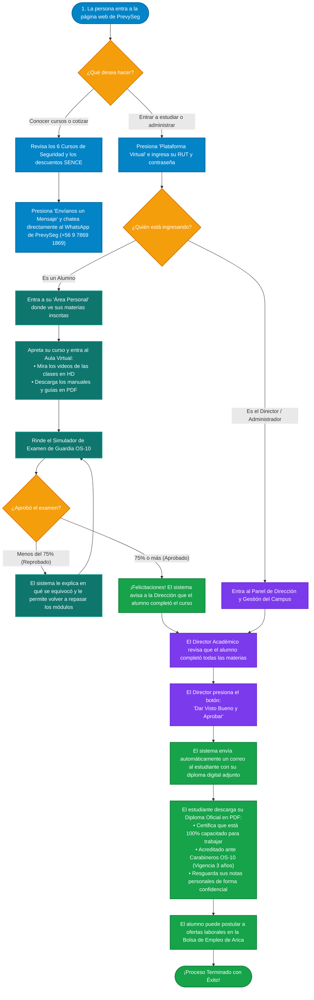
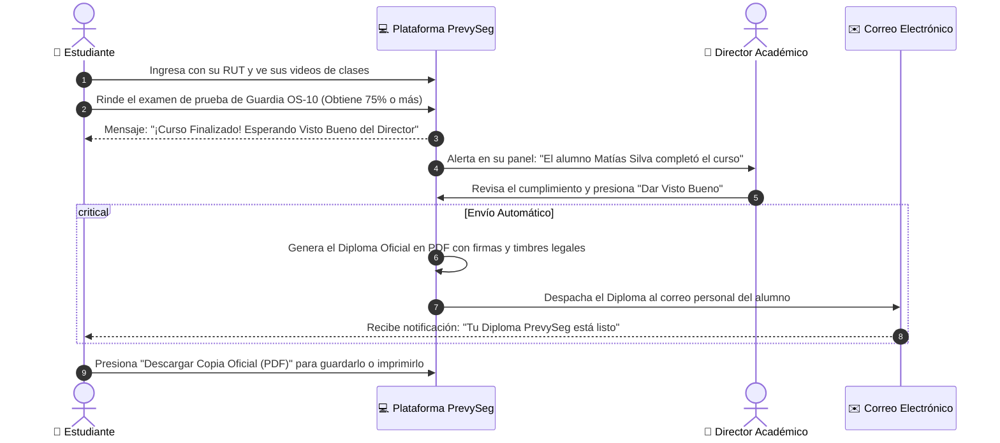
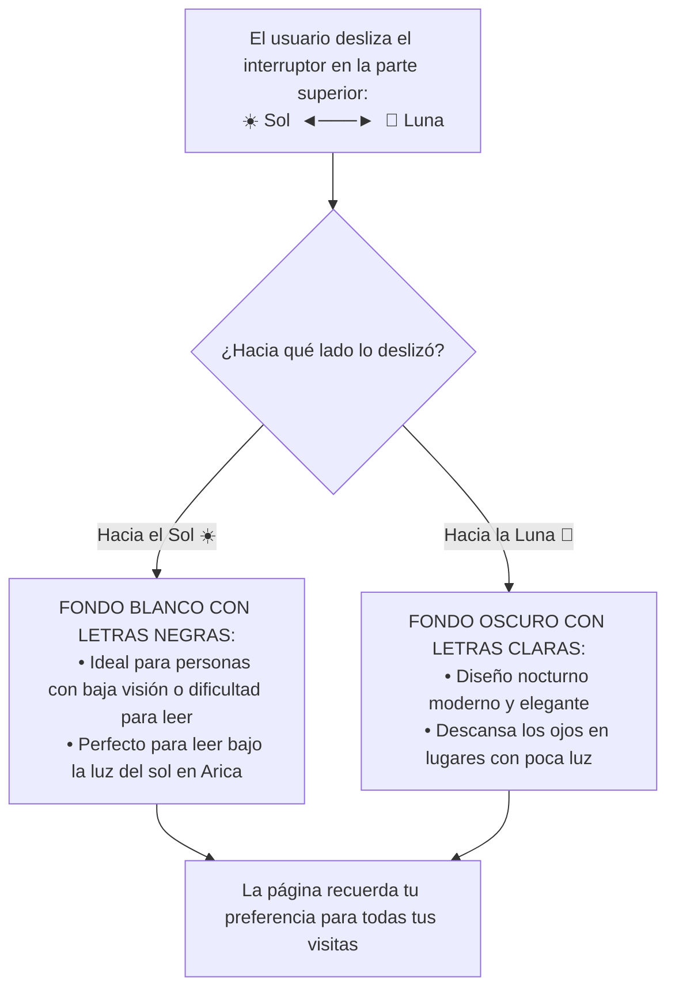

# 🔄 Diagrama de Flujo de Interacción del Usuario (PrevySeg 2026)

Este documento describe el **viaje completo y la interacción de los usuarios** dentro de la plataforma PrevySeg, explicado con **lenguaje simple, intuitivo y sin tecnicismos** para presentaciones ejecutivas y académicas.

---

## 1. 🌟 Diagrama de Flujo Principal: ¿Cómo Interactúa una Persona con la Web?

---

## 2. ⏱️ Diagrama de Secuencia: Paso a Paso entre el Alumno, la Plataforma y el Director

---

## 3. 🌓 Diagrama del Botón de Accesibilidad (Modo Claro / Modo Oscuro)

---

## 4. 📝 Resumen Ejecutivo de los 5 Pasos Clave

1. **Paso 1 (Entrada y Asesoría):** Cualquier persona puede ver los cursos de Guardia de Seguridad, CCTV y Supervisores con financiamiento SENCE, y consultar dudas por WhatsApp en un clic.
2. **Paso 2 (Aula Virtual):** El estudiante entra con su RUT a ver sus videos de clases en alta definición y descarga sus manuales de estudio.
3. **Paso 3 (Evaluación OS-10):** El alumno practica con el simulador oficial de Carabineros OS-10; si no alcanza el 75%, el sistema le explica los errores para que vuelva a intentar.
4. **Paso 4 (Visto Bueno de Dirección):** El Director Académico revisa el expediente del alumno y otorga el visto bueno formal.
5. **Paso 5 (Diploma y Empleo):** El diploma digital oficial llega automáticamente al correo del alumno en PDF (sin notas confidenciales) y se habilita la postulación a la Bolsa de Empleo de Arica.
