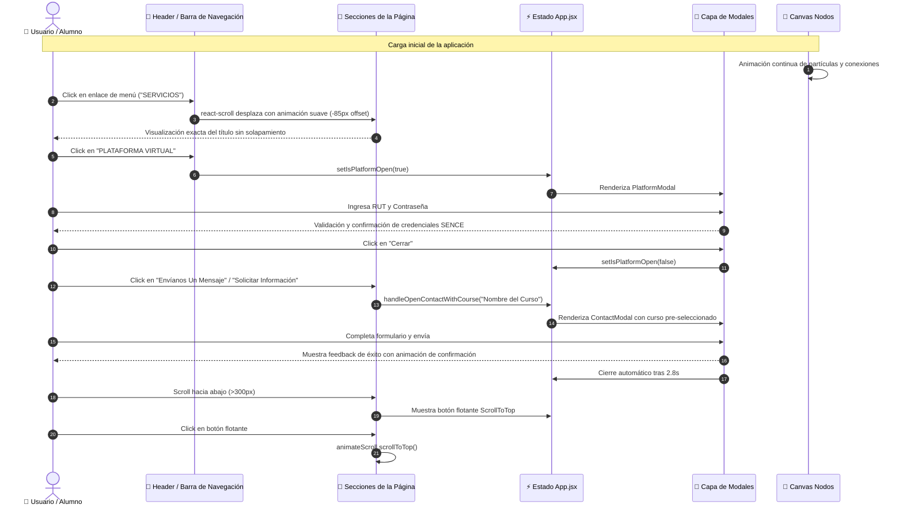

# 🔄 Diagrama de Flujo de Interacción del Usuario

Este diagrama de secuencia ilustra el flujo de interacciones, eventos de click, activación de modales y retroalimentación interactiva dentro de la aplicación.

