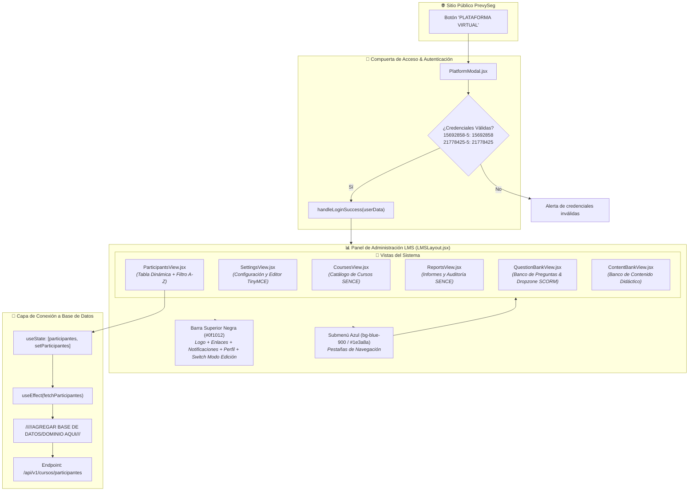

# 🎓 Diagrama de Arquitectura del LMS (Plataforma Virtual)

Este diagrama detalla la arquitectura de la **Plataforma Virtual (LMS)** de PrevySeg, su compuerta de autenticación estricta con credenciales SENCE y la conexión con el estado dinámico de participantes y endpoints de backend.

