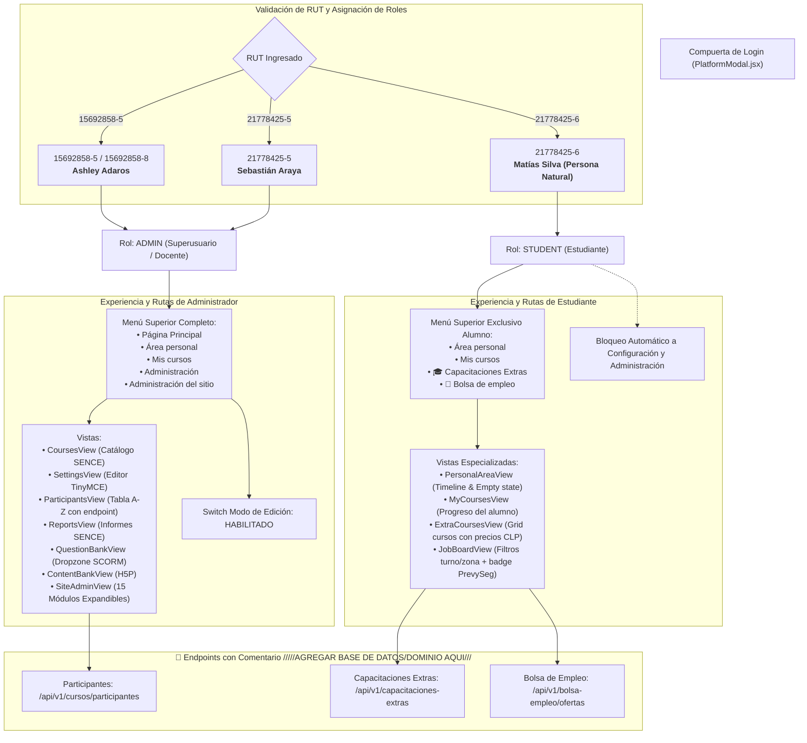

# 🛡️ Diagrama de Control de Acceso Basado en Roles (RBAC)

Este diagrama modela la separación de privilegios, vistas y flujos de datos entre el rol **ADMIN** y el rol **STUDENT** en la Plataforma Virtual PrevySeg.

