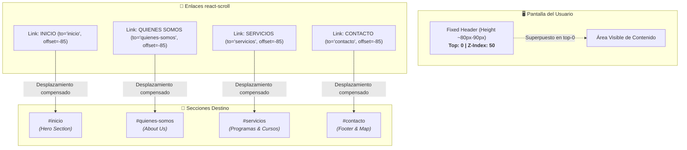

# 📍 Diagrama de Navegación y Offset de Scroll

Este diagrama muestra cómo funciona el sistema de anclas con `react-scroll` y compensación de altura del encabezado fijo para asegurar que los títulos de sección nunca queden ocultos debajo del navbar sticky.

